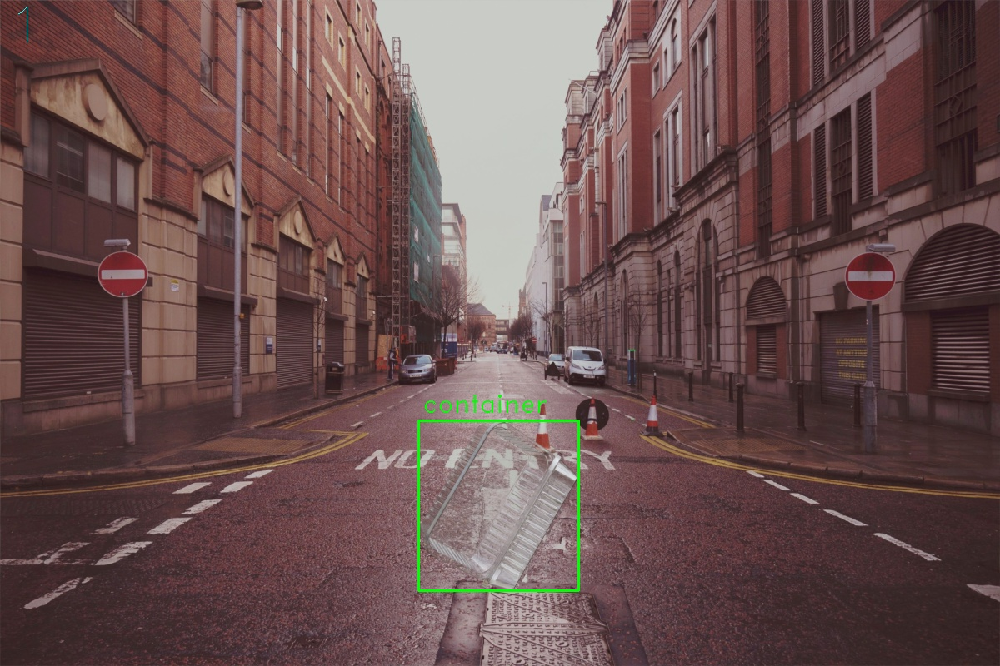

# Synthetic Dataset Blender

Render a dataset for object detection with YOLO format.

Example:




## Table of Contents
- [Stack](#stack)
- [Requirements](#requirements)
- [Clone repo](#clone-repo)
- [Set up blender](#set-up-blender)
   - [Download file](#download-file)
   - [Configure lightning](#configure-lightning)
   - [Set render engine](#set-render-engine)
- [Set up files](#set-up-files)
   - [data.py](#datapy)
   - [executer.py](#executerpy)
- [Run](#run)

## Stack

  


## Requirements
- Python
- Blender (for windows in the default location)
- Many images to use as background

## Clone repo
```bash
git clone https://github.com/rogerramosruiz/synthetic-dataset-blender.git 
cd  synthetic-dataset-blender
```

## Set up Blender 
### Download file 
https://media.githubusercontent.com/media/rogerramosruiz/blender-files/main/plastics.blend

### Configure lightning
Open the file in Blender, go to shading in nodes select world,
in the node Environment Texture select open and select a .exr or HDRI file to use in render, Blender comes with .exr files in the location where it's installed in the version folder datafiles>studiolights>world, select one lighting like city.exr.

### Set render engine
- Development: it's recomended to use Eveee engine
- Generate dataset: Use Cycles engine with GPU

## Set up files
### data.py
In data.py edit this variables

```python
# Location to save the dataset, must be full path
save_dir          = 'D:/dataset_shyntethic'
# Location where are all the images, must be full path
img_dir           = 'D:/images'
```

OPTIONAL: data.py contains other variables used in the render process

### executer.py
In executer.py edit the next variable

```python
# Images to render per class
images_per_classs = 1000
```

When running if the next error happens 
```
Error: System is out of GPU and shared host memory
``` 
Lower the next value
```python
# images to render per execution
max_imgs = 100
```

## Run 
Windows 
```powershell
python executer.py
```
Linux
```bash
python3 executer.py
```

To watch the progress check out progress.txt